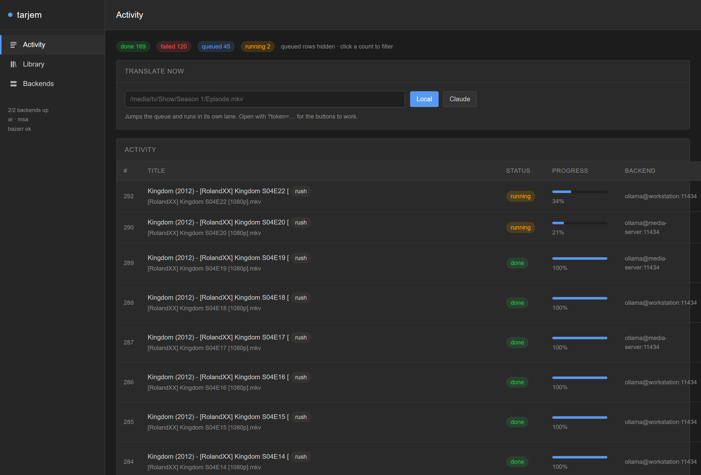
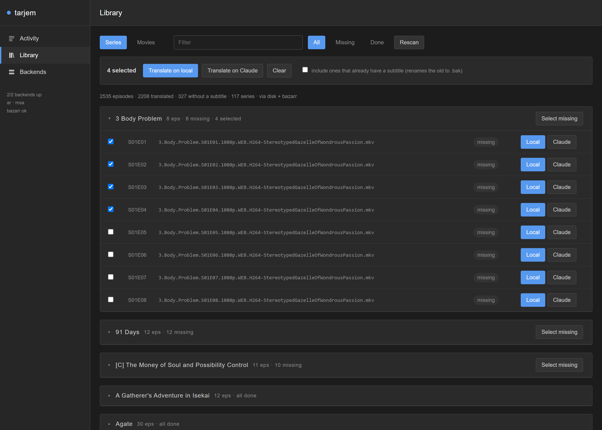
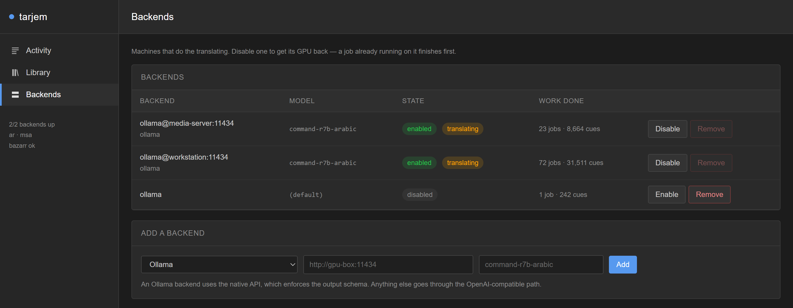
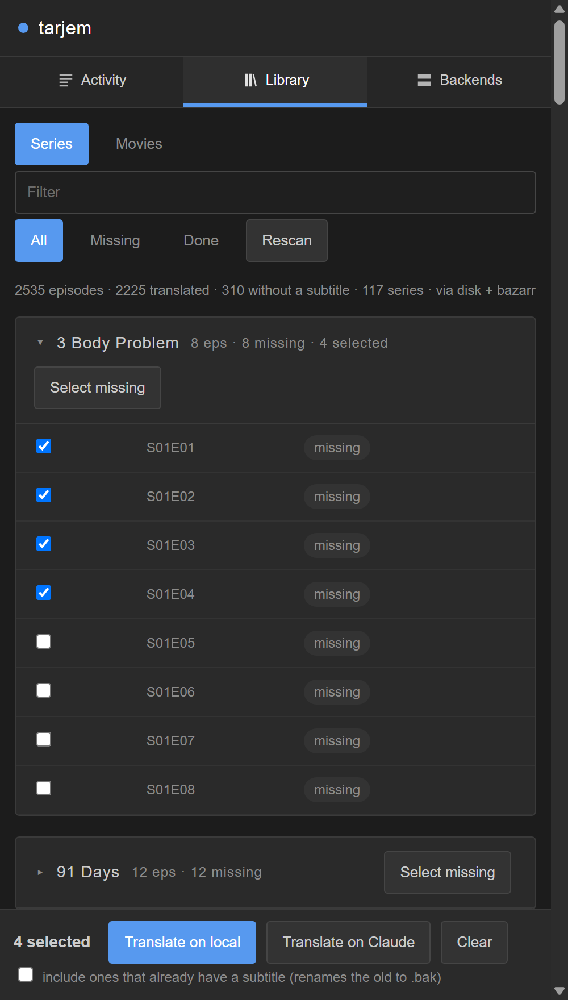

# tarjem

AI Arabic subtitles for the *arr stack. When Bazarr can't find Arabic, tarjem takes
whatever subtitle *does* exist — a sidecar, a track buried in the MKV, or a Whisper
transcript — and translates it, writing `Movie.ar.srt` next to the video where
Jellyfin and Bazarr both pick it up.

It automates the loop you're already doing by hand, and does three things that
pasting an SRT into a chat window can't:

- **A glossary pass first.** Before translating a line, the model reads a sample
  drawn from across the whole file and fixes the Arabic rendering of every
  recurring name, place and coined term. That brief is cached and reused for
  every later episode of the same series, so a character's name doesn't change
  spelling in episode 4.
- **A rolling context window.** Each batch sees the previous cues *and their
  accepted translations*, so pronouns, honorifics and running jokes carry across
  batch boundaries instead of resetting every few hundred lines.
- **Structured id round-tripping.** The model returns cue ids, not a blob. A
  missing or extra line is detected, repaired, and — if repair fails — narrowed
  to that one cue. Timings are never touched, so a bad batch can't desync a file.

---

## What it looks like

The web UI sits alongside Sonarr, Radarr and Bazarr and borrows their layout, so
it reads as another service in the stack rather than a bolted-on script.

**Activity** — what is translating right now, what finished, and which machine did
it. Counts double as filters.



**Library** — everything on disk, grouped by series and sorted by season and
episode. Tick episodes, or take a whole show's missing ones in a click, and send
the selection to a local GPU or to Claude. Films get a tab of their own.



**Backends** — the machines doing the work, and how much each has done. Disable
one to get its GPU back for the evening; a job already running on it finishes
first.



**On a phone** — the rail lies flat as tabs, table rows stack into cards rather
than being squeezed, and the selection bar sticks to the bottom of the screen so
the buttons stay under your thumb while you scroll a season.



---

## How it plugs into your stack

```
Sonarr/Radarr ──> Bazarr ──(finds English, fires post-processing)──> tarjem
                    ^                                                  │
                    └──────────(rescan: the .ar.srt is there)──────────┘
                                                                       │
                                       /mnt/storage/media/.../X.ar.srt ┘
                                                    │
                                                 Jellyfin
```

The stack this was built against — Sonarr, Radarr, Prowlarr, Bazarr, Jellyfin
and the rest as a single compose file — is
[samerzmd/media-server](https://github.com/samerzmd/media-server), which already
carries a tarjem service block wired up to Bazarr. Nothing here depends on that
particular repo, though: any *arr setup works, as long as Bazarr and tarjem
mount the media at the same paths.

Two triggers, and you want both:

| Trigger | Fires when | Covers |
|---|---|---|
| **Webhook** | Bazarr downloads any non-Arabic subtitle | New downloads, automatically |
| **Sweeper** | Every `SWEEP_INTERVAL_MIN` | Your existing library, and anything the webhook missed |

The sweeper asks Bazarr's own `wanted` API what's still missing Arabic, so it
respects your language profiles and exclusions. Set `SWEEP_SOURCE=disk` to walk
`MEDIA_ROOTS` looking for videos with no `.ar.srt` instead.

---

## Setup

### 1. Configure

```bash
cp .env.example .env
```

Fill in `ANTHROPIC_API_KEY` and `BAZARR_API_KEY` (Bazarr → Settings → General →
Security → API key). Set `TARJEM_TOKEN` to any random string if you want the
webhook authenticated.

### 2. Add it to the stack

The compose file here joins the existing `media-server` network and mounts media
at exactly the same paths Bazarr uses, so paths in the webhook resolve without
translation:

```bash
docker compose up -d --build
```

Or paste the service block into your stack's own compose file and bring
everything up together — see [`docker-compose.yml`](docker-compose.yml) for the
block, or
[media-server](https://github.com/samerzmd/media-server) for it already in
place, alongside the rest of the stack. Either way, `user: "1000:1000"` must match the `PUID`/`PGID` the rest of
your stack runs as, or the sidecars land with the wrong owner.

Check it came up: `http://YOUR-SERVER:8081/` shows a live job list.

### 3. Make Bazarr download English

This is the step that's easy to miss, and it's the one that decides whether any
of this works. **If your language profile only wants Arabic, Bazarr never
downloads anything for tarjem to translate** — a failed Arabic search leaves you
with no file at all, not an English one.

Bazarr → Settings → Languages → the profile your library uses → the pencil icon.
Under **Languages**, click **Add Language** and add English alongside Arabic:

| ID | Language | Subtitles Type | Search only when... |
|---|---|---|---|
| 1 | Arabic | Normal or hearing-impaired | Always |
| 2 | English | Normal or hearing-impaired | **Always** |

Three settings in that dialog will silently defeat the whole thing if they're wrong:

- **Cutoff must be empty — not `Any`.** Cutoff means "stop searching once you
  have this". `Any` counts *every* language as satisfying it, so Bazarr gives up
  on Arabic the moment English lands. The field is clearable; clear it.
- **"Search only when..." must be `Always` on the English row.** Set to `no audio
  track matches`, Bazarr skips English subtitles for anything with English audio
  — which is most live-action libraries.
- **"Use Original Format" (under *Subtitles*) should stay off**, so you get clean
  `.srt` sidecars. tarjem converts `.ass`/`.ssa` with ffmpeg anyway, so this is a
  preference rather than a requirement.

Leave **Subtitles Type** as *Normal or hearing-impaired*: an SDH track is more
source text to translate from, and `STRIP_HI=true` removes the `[door creaks]`
annotations on the way out.

Expect a burst of English searches across the library right after you save — the
profile applies to every series and film already assigned to it. Run tarjem on a
single file first (below) and check you like the Arabic before opening that tap.

### 4. Wire the post-processing hook

Bazarr → Settings → Subtitles → **Custom Post-Processing** → enable, and paste:

```
curl -sS -m 30 -X POST http://tarjem:8080/hook/bazarr -H "x-api-token: YOUR_TARJEM_TOKEN" --data-urlencode video={{episode}} --data-urlencode subtitle={{subtitles}} --data-urlencode lang={{subtitles_language_code2}} --data-urlencode series_id={{series_id}} --data-urlencode episode_id={{episode_id}}
```

Drop the `-H "x-api-token: ..."` part if you left `TARJEM_TOKEN` empty.

**Do not put quotes around the `{{...}}` placeholders.** Bazarr already wraps
each value in double quotes when it substitutes, and it strips one quote
character on either side of the placeholder if you add your own.

**Do not use a JSON body here.** Bazarr runs this through `sh -c`, and a title
with an apostrophe in it — `Ocean's Eleven` — breaks single-quoted JSON at the
shell before curl ever sees it. The `--data-urlencode` form above survives it;
tarjem accepts both form-encoded and JSON posts, but only this one is safe.

tarjem ignores hooks where the downloaded language *is* Arabic, so it won't chase
its own output.

### 5. Backfill the existing library

```bash
curl -X POST "http://YOUR-SERVER:8081/sweep?limit=5" -H "x-api-token: YOUR_TOKEN"
```

Start with a small limit and look at the results before opening the tap.
`SWEEP_LIMIT` caps how many one automatic sweep will queue, so a first run can't
work through your whole library in an afternoon.

---

## Try it on one file first

Before wiring anything up, run a single file through and read the output:

```bash
pip install -r requirements.txt
ANTHROPIC_API_KEY=sk-ant-... python -m app.cli "Movie.en.srt" --limit 60
```

`--limit 60` translates just the first 60 cues so you can judge the register
cheaply. `--register gulf` (or `egyptian`, `levantine`, `msa-light`) changes the
dialect. It writes `Movie.ar.srt` next to the input and prints token usage.

To pull the source straight out of an MKV:

```bash
python -m app.cli "Movie.mkv" --from-video --limit 60
```

---

## Where the source subtitle comes from

In order, first hit wins:

1. **A sidecar** next to the video in one of `SOURCE_LANGS` — `Movie.en.srt`,
   `Movie.eng.srt`, `.ass`/`.ssa`/`.vtt` converted on the fly. Forced tracks are
   ranked last (they're signage only, a few dozen cues); anything already Arabic
   is skipped.
2. **An embedded text track**, extracted with ffmpeg. Bitmap tracks (PGS, VOBSUB)
   are skipped — those need OCR, which is out of scope.
3. **Whisper**, if you set `WHISPER_URL` to a whisper-asr-webservice or subgen
   endpoint. Only used when there's no text subtitle at all.

---

## Choosing a model: cost against wall-clock

Every job records its real token usage — `GET /jobs/{id}` returns `usage`,
including how much was served from cache. Trust that over any estimate here.

**Claude.** Measured on two real ~350-cue episodes, about 32k input and 22k
output tokens each:

| `LLM_MODEL` | per episode | per 100 |
|---|---|---|
| `claude-opus-5` | $0.74 | $74 |
| `claude-sonnet-5` (default) | $0.44 | $44 |
| `claude-haiku-4-5` | $0.15 | $15 |

**Output tokens are ~73% of the bill**, so the output price is the lever that
matters. Two settings act on it directly:

- `LLM_THINKING=disabled` (the default) — translation is not a reasoning task,
  and thinking tokens are billed as output. It is dropped automatically on
  models that reject an explicit thinking setting.
- `LLM_EFFORT=low` (the default) — where thinking is on, keep it shallow.

The rules and glossary sit in a cached prompt prefix, so most per-batch input
bills at the cache-read rate.

**Self-hosted.** Free, and much slower than people expect.

With Ollama, use `LLM_PROVIDER=ollama` rather than pointing the OpenAI-compatible
provider at `/v1`. Ollama's `/v1` shim silently ignores `think: false`, so a
reasoning model such as qwen3 spends most of its output budget on a scratchpad
before it starts translating — measured at roughly **ten times** the tokens for
the same result. The native provider also passes the schema to `format`, which
constrains decoding instead of just asking nicely for JSON.

The arithmetic that matters is tokens per second, and it is worth measuring
before committing:

```bash
curl -s http://YOUR-OLLAMA:11434/api/generate -d '{"model":"qwen3:14b",
  "prompt":"Translate to Arabic: I have been chasing this man for six years.",
  "think":false,"stream":false,"options":{"num_predict":60}}' \
| python -c "import json,sys; d=json.load(sys.stdin); print(d['eval_count']/(d['eval_duration']/1e9), 'tok/s')"
```

Then: a 40-cue batch is roughly 2,500 prompt tokens and 1,200 output tokens, and
a file is `cues / BATCH_SIZE` batches. At **1.8 tok/s** — a 14B Q4 model on CPU,
which is what `size_vram: 0` in `/api/ps` means — that lands near **15 minutes
per batch**, so about **2.5 hours per episode** and **8 hours per film**. On a
GPU the same model runs 20–40x faster and the whole calculation changes.

Check `/api/ps` before assuming you have GPU inference:

```bash
curl -s http://YOUR-OLLAMA:11434/api/ps | python -m json.tool
```

`size_vram: 0` means the weights are in system RAM and inference is CPU-bound.

Quality is the other axis, and it is model-specific rather than size-specific.
A bigger general model is often worse at Arabic than a smaller specialised one,
and it is slower too — so reach for a specialist before reaching for parameters:

| Model | Size | Note |
|---|---|---|
| `command-r7b-arabic` | 8B | Cohere, built for Arabic. The default here |
| `emr/silma-9b-instruct` | 9B | SILMA.AI, Arabic-focused |
| `iKhalid/ALLaM` | 7B | Saudi NCAI, trained for Arabic |
| `qwen3:14b` | 14B | Genuinely multilingual, but a generalist |
| `llama3.1:8b` | 8B | Weak Arabic — avoid for this |

Measured on one CPU-only box, same 8 cues, same prompt — the specialist won on
both axes at once, which is the general shape of this trade:

| | `qwen3:14b` | `command-r7b-arabic` |
|---|---|---|
| Generation | 1.44 tok/s | **2.68 tok/s** |
| Grammar/meaning errors | 4 of 8 cues | **1 of 8** |

Mixture-of-experts models (`qwen3:30b-a3b`, `glm-4.7-flash`) activate a fraction
of their weights per token, so they can be *faster* on CPU than a dense model
half their size — worth trying if you have the RAM to load one.

What a small model typically gets wrong in Arabic is grammar rather than
vocabulary: reverse number agreement (`ثلاثة أيام`, not `ثلاث أيام`),
demonstrative gender (`ذلك الشتاء`), the vocative (`أيها القائد`, not
`يا القائد`), and calqued idioms. `GRAMMAR_GUARDRAILS=true` (the default) spells
these out in the system prompt with examples. It costs a few hundred prompt
tokens, which are processed several times faster than they are generated.

Translate one file with `--limit 60` on each candidate and read the output side
by side before choosing. That is cheap, and it is the only test that counts.

A reasonable middle path is to run the local model for the slow backfill and
Claude for new downloads as they arrive, by flipping `LLM_PROVIDER` once the
backlog is clear.

---

## Auth

Two credentials, because there are two kinds of caller:

- **`AUTH_PASSWORD`** — the dashboard sign-in. A signed, HttpOnly session cookie
  keeps you logged in; changing the password signs every session out.
- **`API_TOKEN`** — for machines. Bazarr's webhook sends it as `x-api-token`
  and cannot fill in a login form.

Either one alone enables auth, and an install that only ever set `API_TOKEN`
can sign in with it. **Set a password.** The dashboard can queue jobs against a
paid API, so an open port is a bill waiting to happen — tarjem logs a warning at
startup if neither is configured.

`/health` stays reachable without credentials for the container healthcheck, but
answers a stranger with `{"status": "ok"}` and nothing else. Set
`COOKIE_SECURE=true` if you put tarjem behind HTTPS.

## API

Endpoints take `x-api-token` as a header, `?token=` in the query string, or a
session cookie from the sign-in page.

| Method | Path | |
|---|---|---|
| `GET` | `/` | Status page, auto-refreshing |
| `GET` | `/health` | Provider, Bazarr reachability, job counts |
| `POST` | `/hook/bazarr` | The Bazarr post-processing webhook |
| `POST` | `/translate` | `{"video": "...", "force": false}` — queue one file |
| `POST` | `/sweep?limit=N` | Run a sweep now |
| `GET` | `/jobs?limit=50&status=failed` | Job list |
| `GET` | `/jobs/{id}` | One job, with stats and token usage |
| `POST` | `/jobs/{id}/retry` | Requeue |
| `GET` | `/jobs/{id}/subtitle` | The produced SRT, as text |
| `GET` | `/glossaries` | Cached per-title briefs |
| `GET`/`DELETE` | `/glossaries/{key}` | Inspect or drop one |

Re-translate a file you didn't like: `POST /translate` with `{"force": true}` —
the existing `.ar.srt` is renamed to `.bak` rather than deleted. Drop that title's
glossary first if the problem was a character's name.

---

## Tuning the output

| Setting | Effect |
|---|---|
| `ARABIC_REGISTER` | `msa` (default), `msa-light`, `gulf`, `egyptian`, `levantine` |
| `MAX_LINE_CHARS` / `MAX_LINES` | Caption width discipline. 42×2 is the broadcast norm |
| `BATCH_SIZE` | Cues per request. Lower = more context per cue, more calls |
| `CONTEXT_CUES` | How many previous cues+translations each batch sees |
| `GLOSSARY_ENABLED` | Turn off to skip the brief pass |
| `STRIP_HI` | Drop `[door creaks]` / `SPEAKER:` when the only source is an SDH track |
| `DRY_RUN` | Translate and report, write nothing |

---

## Troubleshooting

**Hook fires but nothing queues.** Look at `docker logs bazarr` for the curl
output. A `404 video not found` means Bazarr and tarjem disagree about paths —
set `PATH_MAP=/bazarr/path:/tarjem/path`. `401` means the token doesn't match.

**"no usable source subtitle found".** Nothing was on disk and nothing text-based
was in the container. Check with
`docker exec tarjem ffprobe -select_streams s -show_streams "/media/movies/.../X.mkv"`.
If the only tracks are `hdmv_pgs_subtitle`, that's a bitmap track — set
`WHISPER_URL` and let Whisper transcribe instead.

**Arabic never gets requested.** Confirm the language profile actually lists
Arabic *and* English, and that the profile is assigned to the series or film.

**Names drift between episodes.** Check `GET /glossaries` — if the series has no
entry, the brief pass failed. If it has a wrong entry, `DELETE` it and re-run.

**Nothing appears in Bazarr.** tarjem asks Bazarr to rescan only when the webhook
or sweep gave it an item id. Otherwise Bazarr picks the file up on its next scan;
the file is already on disk either way.

---

## Development

```bash
python -m venv .venv && .venv/bin/pip install -r requirements.txt pytest
.venv/bin/python -m pytest tests -q
```

The tests stub the provider — no API key, no network. They cover SRT round-trip
fidelity, batch repair when the model drops a cue, markup preservation, and the
webhook shapes Bazarr actually sends.

---

## License

[MIT](LICENSE) — tarjem's own code, and that is all it covers. What you point
it at comes with its own terms, and the default local model has real strings
attached:

| | Licence |
|---|---|
| **tarjem** | MIT |
| **`command-r7b-arabic`** — the default local model | [CC-BY-NC 4.0](https://huggingface.co/CohereLabs/c4ai-command-r7b-arabic-02-2025) plus Cohere Labs' Acceptable Use Policy — **non-commercial** |
| **Claude** | Anthropic's commercial API terms, billed per token |
| **Ollama, Bazarr, the *arrs** | Separate projects, each under its own licence |

The non-commercial one is the one to notice: Cohere Labs release Command R7B
Arabic for research and personal use, not for running a business on. Nothing in
tarjem depends on that particular model — point `OLLAMA_MODEL` at a
permissively licensed one if it matters to you.

A translation is also a derivative of the subtitle it came from. Whatever you
were entitled to do with the English track, you are entitled to do with the
Arabic one — and no more.
